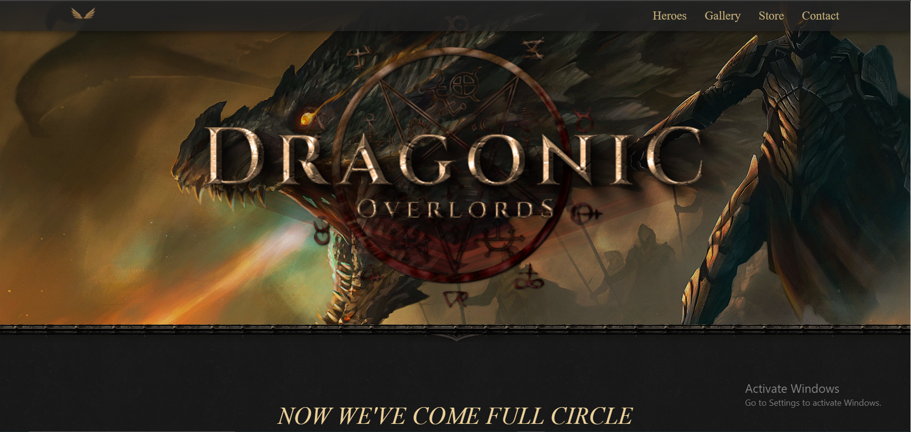
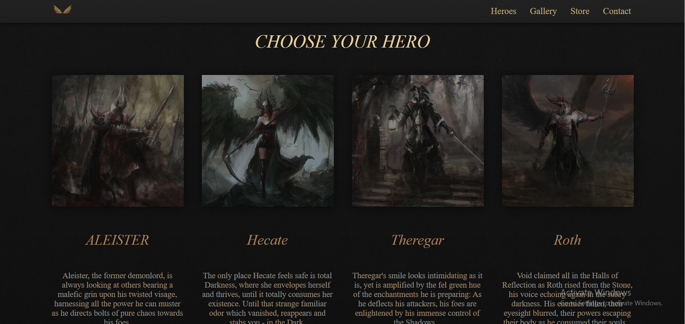
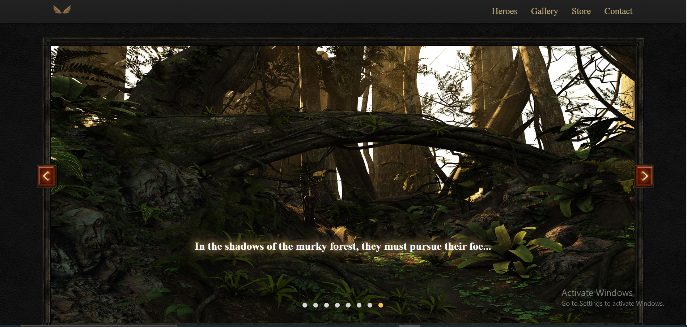
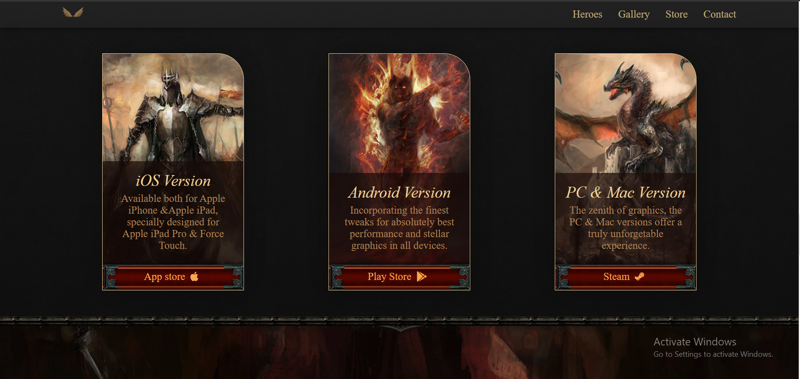
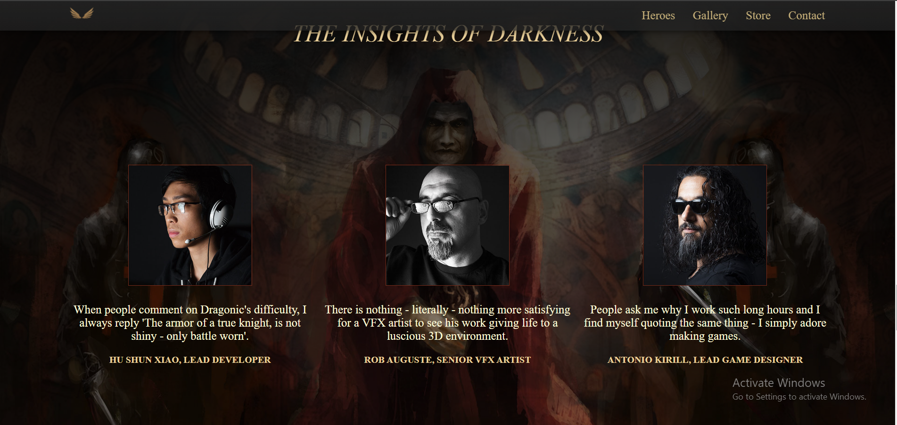
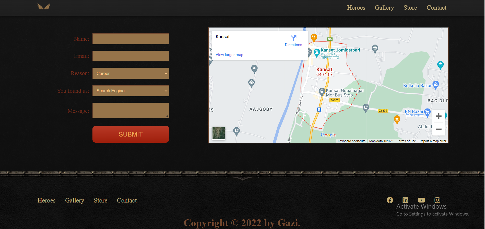

# Dragon overloads

### Features:

<ul>
    <li>Heroes.</li>
    <li>Gallary</li>
    <li>Store.</li>
    <li>Contact.</li>
</ul>

## Language used:

1. HTML 3
2. CSS.
3. Bootsstrap.

## code Editors:

1. Visual studio code.

## Browser:

1. Google chrome.

Screen Shots:

## Landing page:

The landing page is all about the pages and other overviews of the pages.The dragon overloads has 4 ultimate pages.

Page 2: The page 2 has the four heroes consists that can user choose from the websites

This section consists of slider image with different sceene of our games.

 
This page consist of the versions of the operating system of the game that supports to the game modes.

The insides of darkness page can gives a short description that the developer made.

<h2 style="color:red"> Contact us:</h2> 
Contact us page can gives you access to reach us imidiately if you find any problem or bug of system loss to your system.
   
Thankyou,  
Gazi Ehsanul Haque 
   

# Author

## Gazi Ehsanul Haque

## American International University Bangladesh

# Contact Info:

1. Github : <a href="https://github.com/antik1801" target="_blank"> https://github.com/antik1801
2. Whatsapp: +8801869694519  
3. linkedin : <a href="https://www.linkedin.com/in/gazi-ehsanul-haque-3b8b92249/" target="_blank">https://www.linkedin.com/in/gazi-ehsanul-haque-3b8b92249/
4. Facebook: <a href="https://www.facebook.com/eshanulhaque.antik" target="_blank">https://www.facebook.com/eshanulhaque.antik

# Thankyou for supporting me .
